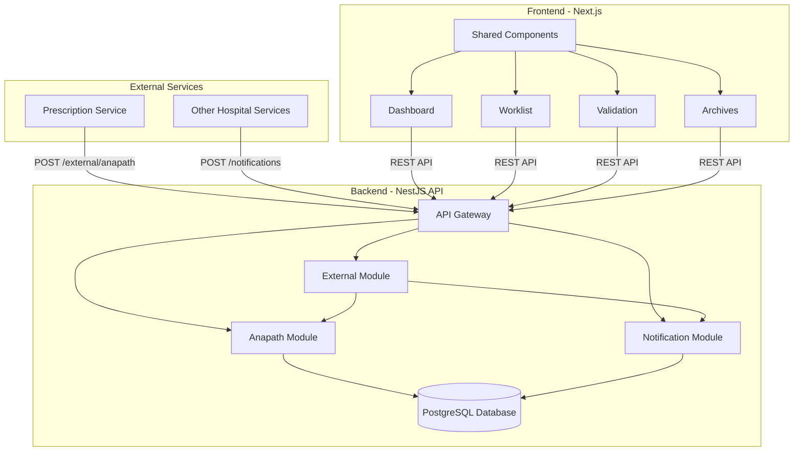
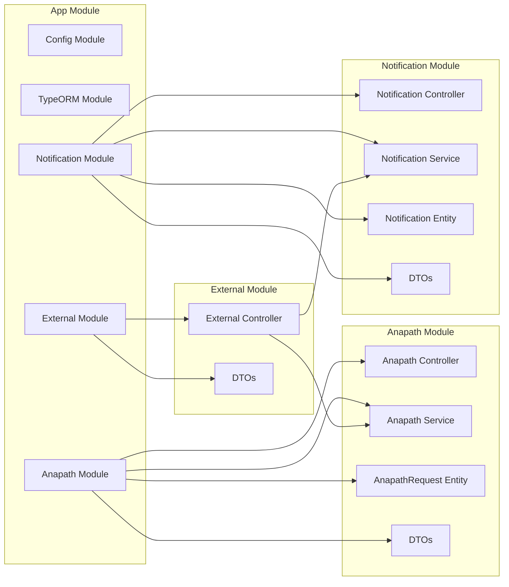
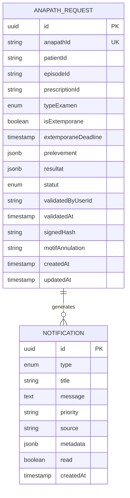
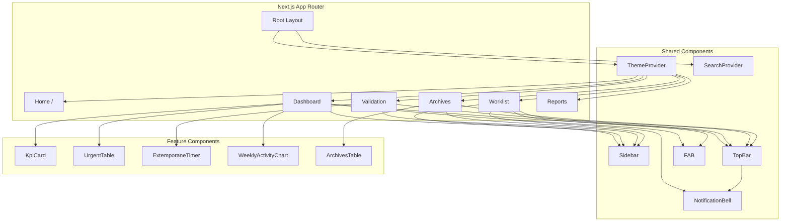
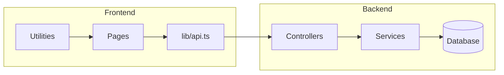
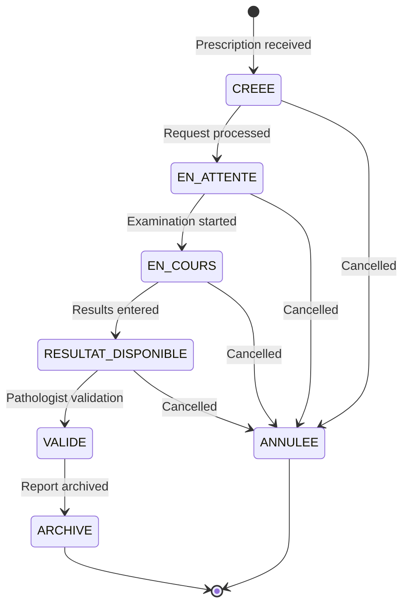

# Anapath System - Architecture Diagram

## System Overview

The Anapath System is a hospital information system for managing anatomical pathology examinations. It follows a monorepo structure with separate backend (NestJS) and frontend (Next.js) applications.

## Backend Architecture

### Module Structure

### Database Schema

## Frontend Architecture

### Page Structure

### API Layer

## Request Workflow

## API Endpoints

### Anapath Module
- `POST /anapath` - Create new examination request
- `GET /anapath` - List all requests
- `GET /anapath/:id` - Get request by ID
- `PATCH /anapath/:id` - Update request (results, status)
- `POST /anapath/:id/validate` - Validate with digital signature

### Notification Module
- `POST /notifications` - Receive notification (standard or legacy format)
- `GET /notifications` - List all notifications
- `GET /notifications/unread/count` - Count unread notifications
- `PATCH /notifications/read-all` - Mark all as read
- `PATCH /notifications/:id/read` - Mark as read

### External Module
- `POST /external/anapath` - Receive prescription from external service

## Key Technologies

- **Backend**: NestJS 10, TypeORM, PostgreSQL 16
- **Frontend**: Next.js 15/19, React, TailwindCSS, Axios
- **Deployment**: Render (PaaS)
- **Documentation**: Swagger/OpenAPI

## Data Flow

1. **Prescription Intake**: External services send prescriptions to `/external/anapath`
2. **Request Creation**: ExternalController creates AnapathRequest and triggers notification
3. **Lab Processing**: Pathologists view worklist, update results via `/anapath/:id`
4. **Validation**: Pathologist validates with digital signature via `/anapath/:id/validate`
5. **Archiving**: Validated reports are archived and can be exported as PDF
6. **Notifications**: Real-time alerts between services via notification system

## Security Features

- Digital signature for validation (signedHash)
- Service-to-service authentication via x-service-id header
- Role-based access (implied by validation workflow)
- SSL/TLS for database connections
